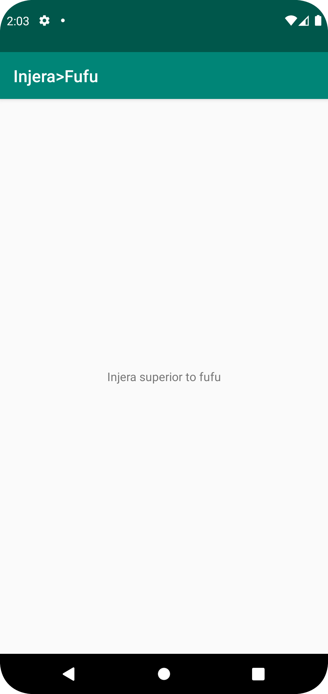

# Rapport

Det som uppdaterades var namnet från Hello till Injera>fufu genom att byta texten i strings.xml.
Texten i textview ändrades även till injera superior to fufu genom att addera en ny string med ett nytt name, och sedan kalla på det name i textview:n.

```
<resources>
    <string name="app_name">Injera>Fufu</string>
    <string name="app_text">Injera superior to fufu</string>
</resources>
...
<TextView
    ...
    android:text="@string/app_text"
    ...
/>
```




